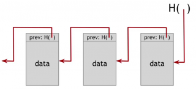
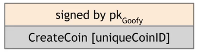
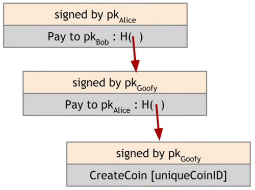
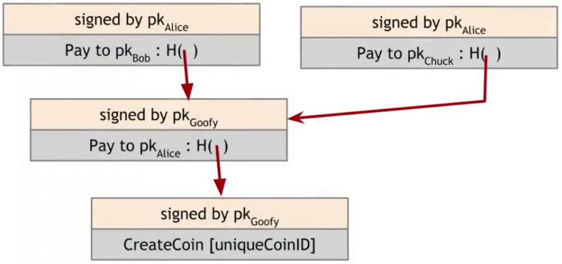
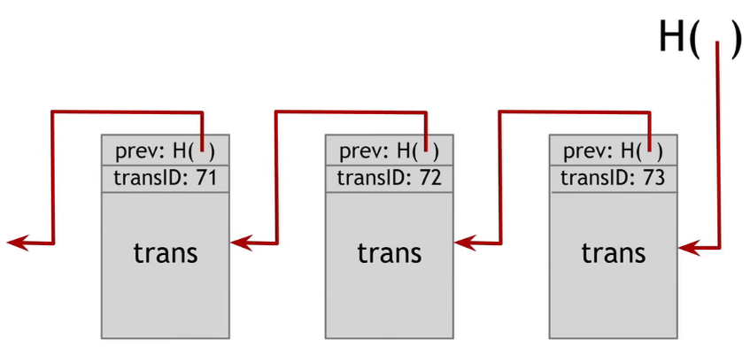
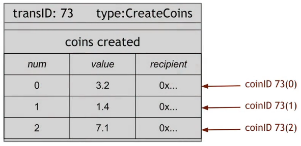
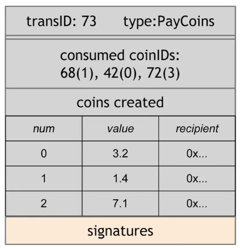

# Week 1: Introduction to Crypto and Cryptocurrencies

## Lecture key points

### Hash function y = H(x)
  - Input x: any string
  - Output y: fixed-size output (e.g. 256 bits)
  - Properties:
    - Collision-free: Very hard to find x1 != x2, so that H(x1) == H(x2)
    - Hiding: Given output y, very hard to find input x
    - Puzzle-friendly: Given output y, try randomly to find input x

### Hash pointer

A hash is used as a pointer to info.  
This is a chain of hash pointers:

Tamper detection: The head of the chain can identify whole chain. Any tamper in any block will make the head changed.
So we can detect tamper.

Prove a block belongs to chain: one must provide the block data, and all following blocks. We then calculate to find
the head. If matched then that block belongs to our chain. Time complexity: O(N).

### Merkle tree

Binary tree with hash pointers.  
Leaves: label (hash of data).  
Non-leaves: hash of its children's labels.  

Tamper detection: The head is top hash, similar to hash pointer chain, Merkel tree can detect tamper.

Prove a block belongs to chain: improved speed compared to hash pointer chain O(logN).  
E.g. to confirm Datablock 002 belongs to chain, one must provide Datablock 002, and all upper node hashes (Hash 1-1, 
Hash 0), so we can calculate top hash.

### Digital signature
Only you can sign (by secret key), any one can verify (by public key)  
Signature is tied to one document, different documents have different signature (but signed by same secret key).  

Steps:
1. Create an identity (sk and pk)
2. Signing (create signature for a document)  
signature = sign(sk, doc)
3. Verify (check if correct identity signed that doc)  
isValid = verify(pk, doc, signature)

Use case:
  - Bob composes a `doc`, sign it with his `sk`, which result a `signature`.
  - Bob tell Alice to give that `doc` and `signature` to Charlie.
  - Alice delivers them to Charlie.
  - Charlie doesn't trust Alice, he want to confirm Bob actually signed on that doc.
  - Charlie knows about Bob identity (Bob's `pk`). He uses API verify(pk, doc, signature) and confirmed.

### Public key as identity

If one document can be verify by `verify(pk, doc, signature)`, we can say `pk` composes `doc`.  
`pk` represents for an entity (like Bob, Alice...). This entity use `sk` to create `signature`.  

So, to verify `doc` is signed by an entity (`pk`), just verify it with `signature` linked with `doc`.  
NO central organization needed here.

That introduces **decentralized** identities management.

### Simple cryptocurrency

#### Goofy Coin

  - Goofy invents a cryptocurrency.

  - Goofy can create coin from air:  

  - Goofy sends coin to Alice, and Alice sends to Bob:  
  
There are 2 transactions above, each tx is signed by owner.

  - Problems: double spending:
  
Alice signed 2 tx, with the same source. Bob and Chuck don't know about each other.  

#### Scrooge Coin

  - Scrooge improves Goofy coin, by introducing a public ledger, signed by Scrooge.
  
Each block describes the tx.  
  - Everybody can verify the tx, by looking into that blockchain.  
  - Solve double-spending attack:  
    - If Alice paid to Bob, this tx is recorded in blockchain.
    - Then if Alice pays the same coin to Chuck, Chuck would look into blockchain, and find out that coin was already
    spent, and reject that tx.  
  - Create coins:  
  
This tx take no input, and creates an output that has 3 coins, to 3 recipients..
  - Spending coins:  
  
A tx consumes some coins in previous transaction output, and creates new output consist of coins assigns to
recipients. Each consumed coin (input) must signed by its owner.  

**New problem:** Scrooge must be trusted (central trusted party) because only he can publish blockchain.

## Assignment: Scrooge Coin

In this assignment, we're going to implement the transaction handler, that validate a list of tx.

A tx consist of:  
  - List of Inputs, which actually be the Outputs of previous tx.  
  - List of Output: to whom and how many coin.

At specific time, list of Inputs turns out to be the unspent coins, we call them **Unspent Transaction Output (UTXO)**
and we have to keep a list of that UTXO (called UTXO Pool). As we processing tx, we should update that pool too.

The condition for each tx to be valid is straight forward:  
  - (1) all outputs claimed by {@code tx} are in the current UTXO pool,  
  - (2) the signatures on each input of {@code tx} are valid,  
  - (3) no UTXO is claimed multiple times by {@code tx},  
  - (4) all of {@code tx}s output values are non-negative, and  
  - (5) the sum of {@code tx}s input values is greater than or equal to the sum of its output

Condition (1) confused me, as it could be rewritten as: All TX's inputs should only consume the UTXO currently in pool.

Condition (2) actually asks us to verify the Inputs. Just find the corresponding Output in prev tx, and use `Crypto.verifySignature`

Should be noticed that some TXs depend on other TXs, so we need to verify dependence TXs first.

About bonus point (MaxFeeTxHandler.java), it's actually about finding algorithm to pick set of TXs that has maximized
sum of transaction fee, i.e. max(inputs - outputs).  
I think it's for miners, who want create new block that has biggest reward.  
I'm too lazy for that, will come back to this later.