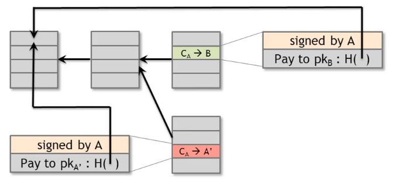

# Week 2: How Bitcoin Achieves Decentralization

## Decentralization of Bitcoin
1. Who maintain the ledger
2. Who has authority over which txs are valid
3. Who create new bitcoins
4. Who determines how the rules of the system changes
5. How do bitcoins acquire exchange value

## Steps to achieve consensus
1. Users **broadcast some txs** to network
2. All nodes currently listening, but the network is large and distributed, so just some nodes may **receive those
broadcasts**. It's may take time for other nodes can receive those broadcasts 
3. The nodes that received broadcasts then verify txs and **create new block** with these txs.  
  - The creation of new block costs computation power (must solve puzzle, finding hash, nonce... see Proof-of-work)  
  - Node can includes any txs that it prefers (even invalid txs)
4. When any node done creating new block, it **proposes that block** to the network.  
5. Other nodes can decide to **accept or reject that block**.  
  - If one node decided to accept, it add that block to the blockchain  
  - If one node decided to reject, it just ignore that block, and use last blockchain  
6. Once a block is added to blockchain, we called the contained txs in that block are **confirmed**. But note that it's
just **1 confirmation**. Later on, when a new block added to the blockchain, we can call those txs are **confirmed 2
times**, and so on. The more confirmations, the more certain those txs are valid (usually is 3 in bitcoin)

## Double-spending attacks

The green tx above is confirmed 1 time.

A malicious node decides to reject that block, and extend last old blockchain. It creates block that contains tx that
use the same source (double spending). That block is broadcast to the network.

At this time, the blockchain has 2 new blocks (both are completely valid from technical point of view).  

Now it depends on other nodes:
  - If other nodes decide to accept green block, the attack is failed.
  - If other nodes decide to accept red block, the attack is succeed.

That's why the recipient should **wait for more confirmations** before decide that a tx is done.  
  
By the time green tx got 3 confirmations, red tx just got 1 confirmations. The red blockchain is shorter in length, then
it will likely be rejected by other nodes. 

## Why nodes should honest?

Because of the incentive - the reward in bitcoin by acting honestly.

There are 2 types:  
  - Block creation reward: currently 25BTC, halves every 4 years
  - Transaction fee: voluntarily by user

## Proof-of-work

Any nodes can propose new block. But to create new block, node has to randomly guess a `nonce`, so that:  
`H(nonce | prev_hash | TX...) is very small`  

The faster node performs guessing  
-> the more chance of finding `nonce`, and create new block  
-> the more reward node can get  

So it's all about computation power.  

### Average time between blocks is 10 minutes

That means creation time of a new block should be 10 minutes.  

Over time, the more miners will join and computation power also increases, that shorten the creation time of new block.
That why bitcoin network recalculate the target, to keep 10-min creation time.  

But this equation is always true:  
`Probability(Alice wins next block) = ComputationPower(Alice) / ComputationPower(WorldTotal)`  

### Summary PoW properties
Hard to compute (cost hash power)  
Parameterizable cost (clearly calculated by hash power)  
Easy to verify  

## What make bitcoin sustain

  

## 51% attacker
  - CAN'T: steal coin from others
  - CAN: Suppress some txs
  - CAN'T: change block reward
  - CAN: Destroy confidence of Bitcoin