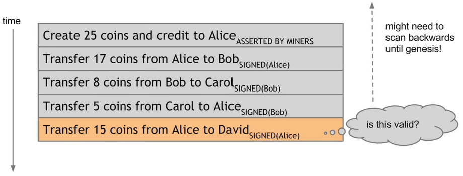
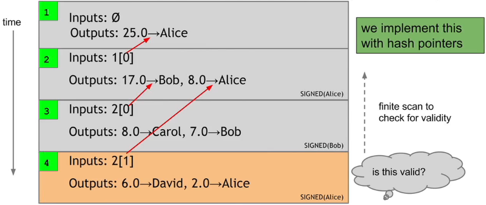
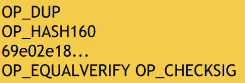
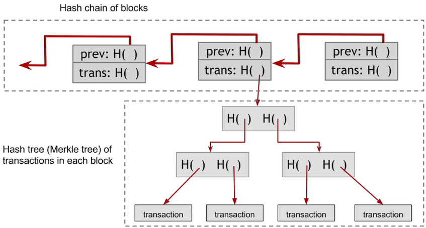

# Week 3: Mechanics of Bitcoin

I'm too lazy to take note all content of this lecture.  

## Account-based ledger (not bitcoin)

  
When verify each transaction, must scan backward to check if account balance has enough amount.

## Transaction-based ledger (bitcoin)

  
When verify each transaction, just check input  

## Bitcoin script

The **output address** of transaction is actually a **script** (not just a pk of recipient), for example:  
  
There are 4 operation in above script.  

Bitcoin scripting language is simple, stack-based, no looping.  

[Example of executing an output script](https://www.coursera.org/learn/cryptocurrency/lecture/HWjti/bitcoin-scripts)  

blah blah blah

## Script application
Escrow
Green address
Micro transaction

## Bitcoin block

  
Note that there are 2 hash structure: one for chain of block, the other for txs in one block  

## Bitcoin network

Ad hoc random topology run on TCP 8333  
3-hr TTL node  

### Joining network

  - New node connects to predefined seed node.  
  - Seed node transfers to new node info about other connected nodes.  
  - New node then connects to those nodes.  

### Broadcast transaction
  - First node received a new tx, it then verify that tx with its current blockchain state (new, non-conflict)
  - If tx is valid, the node forwards tx to connected nodes. Gossiping protocol.  

### Tracking the UTXO set

For speed up processing, full nodes store UTXOs in memory. Each UTXO describes the unspent output and which tx it
belongs to. So whenever new tx happens, node can check UTXO pool and verify tx quickly.  

### Thin/SPV client

Store block header only, reduce size 1000 times  
Lazy fetch txs  

## Limitations

### Hard-coded limit
  - 10-min block creation time -> 7tx/sec (low)
  - 1MB block size
  - 20000 signature ops per block
  - 100M satoshi per BTC
  - Max 21M BTC
  - 50, 25, 12.5... BTC mining reward
  
### Cryptographic can be outdated

### Hard-fork

Software fully upgraded, new blocks are rejected by old nodes.

### Soft-fork

Slightly upgrade software, reject some of new blocks (stricter rules)
